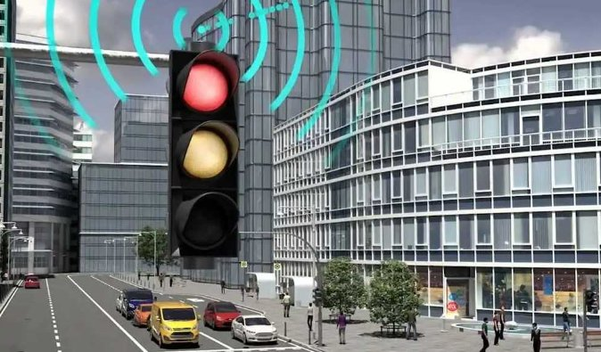

# 🚦 Controle de Trânsito
<div align="center">
  
</div>

Internet das Coisas para melhorar o fluxo do trânsito. Cada semáforo dos cruzamentos de algumas
ruas é um nó de um sistema distribuído, que se comunicarão entre si, para organizar o trânsito.

### Documento do projeto

- [Documento em Pdf](https://github.com/andrefarias11/ProjetoIntegrador_IV/blob/main/Documento/Documenta%C3%A7%C3%A3o%20PI4.pdf):


###  OBS : O documento está passando por constantes updates 

O documento PDF a seguir contém toda a documentação essencial para o projeto, incluindo detalhes sobre requisitos do sistema, análise estrutural e outras informações relevantes:

* Documento de Requisitos do Sistema: Este documento abrange os requisitos funcionais e não funcionais do sistema, especificando o que o sistema deve fazer e como deve se comportar.
* Documento do Modelo Arquitetural: Este documento descreve a arquitetura do sistema, incluindo componentes-chave, interações e visão geral da estrutura do projeto.

Essa documentação é crucial para compreender o projeto, suas metas e funcionalidades, e é uma referência valiosa para todos os envolvidos no desenvolvimento e implementação do sistema.

### Ajustes e melhorias

O projeto ainda está em desenvolvimento e as próximas atualizações serão voltadas nas seguintes tarefas:

- [ ] Facilitar o fluxo para ambulâncias e bombeiros, mantendo os semáforos na cor verde no
caminho a frente da ambulância. Se os semáforos estiverem vermelhos, reduzir o tempo do
semáforo em vermelho;
- [ ] Ao detectar um veículo roubado, avisar a polícia;
- [ ] Quando um acidente ocorrer, comunicar as autoridades de trânsito
- [ ] Se o fluxo de veículos aumentar em 30% além do normal, aumentar em 20% o tempo do
semáforo e dos próximos no possível fluxo dos veículos, em cor verde;
- [ ] Exibição do histórico do fluxo de veículos e ocorrência de situações (ambulância,
bombeiro, acidente e viatura policial) em cada semáforo para análise;
- [ ] Mapa mostrando a movimentação dos veículos e a cor de cada semáforo, durante o
tempo de execução do sistema;

## 💻 Pré-requisitos

Antes de começar, verifique se você atendeu aos seguintes requisitos:

* Você instalou a versão mais recente de `<linguagem / dependência / requeridos>`
* Você tem uma máquina `<Windows / Linux / Mac>`.
* Você leu `<guia / link / documentação_relacionada_ao_projeto>`.


## 🚀 Instalando <nome_do_projeto>

Para instalar o <nome_do_projeto>, siga estas etapas:

Linux e macOS:
```
<comando_de_instalação>
```

Windows:
```
<comando_de_instalação>
```
## 👨‍💻 Colaboradores

<div align="center">
  <table>
  <tr>
    <td align="center">
      <a href="#">
        <br>
        <sub>
          <b>André Farias</b>
        </sub>
      </a>
    </td>
    <td align="center">
      <a href="#">
        <br>
        <sub>
          <b>Zairo Bastos</b>
        </sub>
      </a>
    </td>
    <td align="center">
      <a href="#">
        <br>
        <sub>
          <b>Marlon Duarte</b>
        </sub>
      </a>
    </td>
    <td align="center">
      <a href="#">
        <br>
        <sub>
          <b>Victor Jones</b>
        </sub>
      </a>
    </td>
  </tr>
</table>
</div>
